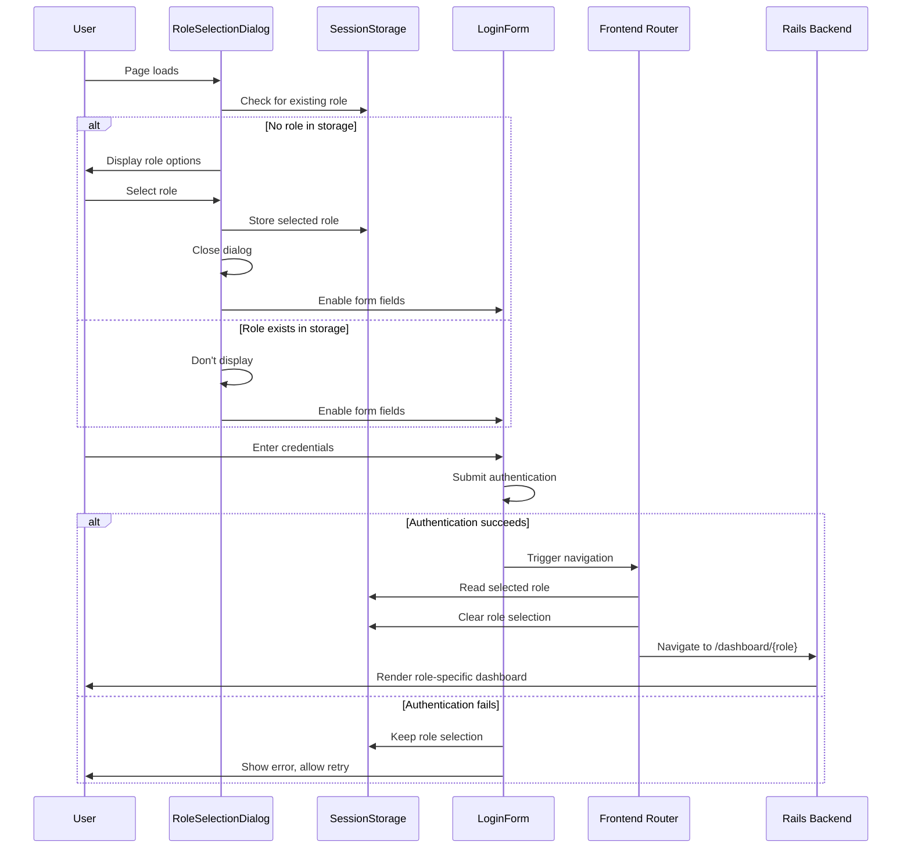

# Design Document: Role Selection Login

## Overview

This feature adds a role selection dialog to the existing Canvas LMS login page, enabling users to select their role (Student, Faculty, Staff, Admin, Guardian/Parent, or HOD) before authentication. The selected role is persisted in sessionStorage and used by the frontend router to direct users to role-specific dashboards after successful login.

This implementation includes both frontend modifications (role selection dialog) and backend modifications (role-specific dashboard routes and views). Each role will have its own dedicated dashboard route (e.g., `/dashboard/student`, `/dashboard/faculty`) that renders a role-specific view.

### Key Design Decisions

1. **Role-Specific Dashboards**: Each role has a dedicated dashboard route and view template, allowing for role-appropriate customization
2. **Backend Route Duplication**: Six new routes and controller actions created by copying the base dashboard implementation
3. **Frontend-Only Role Selection**: Role selection dialog is purely frontend; no backend authentication changes
4. **SessionStorage for Persistence**: Role selection persists across authentication failures but clears on successful login
5. **InstUI Modal Component**: Leverages Canvas's existing InstUI modal patterns for consistency
6. **Progressive Enhancement**: Existing login functionality remains unchanged; role selection is additive
7. **Accessibility-First**: Full keyboard navigation and screen reader support from the start
8. **Backward Compatibility**: Base `/dashboard` route remains for users without role selection

## Architecture

### Component Structure

```
LoginPage (existing ERB template)
├── RoleSelectionDialog (new React component)
│   ├── RoleOption (Student)
│   ├── RoleOption (Faculty)
│   ├── RoleOption (Staff)
│   ├── RoleOption (Admin)
│   ├── RoleOption (Guardian/Parent)
│   └── RoleOption (HOD)
├── RoleIndicator (new React component)
└── LoginForm (existing)
```

### Integration Points

1. **Login Page Template**: `app/views/login/canvas/_new_login_content.html.erb`
   - Add React mount point for RoleSelectionDialog
   - Add React mount point for RoleIndicator
   
2. **Frontend Router**: Post-authentication routing logic
   - Read role from sessionStorage
   - Route to role-specific dashboard page
   - Map roles to dedicated dashboard routes

3. **Backend Routes**: `config/routes.rb`
   - Add six new role-specific dashboard routes
   - Each route maps to a dedicated controller action

4. **Backend Controller**: `app/controllers/users_controller.rb`
   - Add six new dashboard action methods (one per role)
   - Each method renders a role-specific view template

5. **View Templates**: `app/views/users/`
   - Create six role-specific dashboard templates
   - Each template based on the base dashboard template

6. **SessionStorage**: Browser storage for role persistence
   - Key: `canvas_selected_role`
   - Value: One of `['student', 'faculty', 'staff', 'admin', 'guardian', 'hod']`

### Data Flow



## Components and Interfaces

### RoleSelectionDialog Component

**Location**: `ui/features/login/react/RoleSelectionDialog.tsx`

**Props**:
```typescript
interface RoleSelectionDialogProps {
  onRoleSelect: (role: UserRole) => void
  isOpen: boolean
}
```

**State**:
```typescript
interface RoleSelectionDialogState {
  selectedRole: UserRole | null
}
```

**Responsibilities**:
- Render modal dialog with six role options
- Handle role selection via click or keyboard
- Close dialog after selection
- Provide accessibility features (ARIA labels, keyboard navigation)

### RoleIndicator Component

**Location**: `ui/features/login/react/RoleIndicator.tsx`

**Props**:
```typescript
interface RoleIndicatorProps {
  selectedRole: UserRole | null
  onChangeRole: () => void
}
```

**Responsibilities**:
- Display currently selected role
- Provide button to reopen role selection dialog
- Hide when no role is selected

### RoleOption Component

**Location**: `ui/features/login/react/RoleOption.tsx`

**Props**:
```typescript
interface RoleOptionProps {
  role: UserRole
  label: string
  onClick: (role: UserRole) => void
  isFirst: boolean
}
```

**Responsibilities**:
- Render clickable role option
- Handle click and keyboard events
- Provide focus management
- Display appropriate ARIA labels

### LoginPageContainer Component

**Location**: `ui/features/login/react/LoginPageContainer.tsx`

**Props**: None (reads from sessionStorage)

**State**:
```typescript
interface LoginPageContainerState {
  selectedRole: UserRole | null
  isDialogOpen: boolean
  isFormEnabled: boolean
}
```

**Responsibilities**:
- Orchestrate RoleSelectionDialog and RoleIndicator
- Manage sessionStorage interactions
- Control login form enabled state
- Handle dialog open/close logic

### Frontend Router Enhancement

**Location**: `ui/shared/util/loginRouter.ts` (new file)

**Interface**:
```typescript
interface RoleRouteMap {
  student: string
  faculty: string
  staff: string
  admin: string
  guardian: string
  hod: string
  default: string
}

function navigateAfterLogin(): void
```

**Responsibilities**:
- Read selected role from sessionStorage
- Map role to appropriate route using ROLE_ROUTES
- Navigate to role-specific dashboard (e.g., `/dashboard/student`)
- Handle missing role gracefully (navigate to default `/dashboard`)
- Clear role from sessionStorage after navigation

**Implementation**:
```typescript
const ROLE_ROUTES: RoleRouteMap = {
  student: '/dashboard/student',
  faculty: '/dashboard/faculty',
  staff: '/dashboard/staff',
  admin: '/dashboard/admin',
  guardian: '/dashboard/guardian',
  hod: '/dashboard/hod',
  default: '/dashboard'
}

function navigateAfterLogin(): void {
  const roleData = sessionStorage.getItem('canvas_selected_role')
  let targetRoute = ROLE_ROUTES.default
  
  if (roleData) {
    try {
      const { role } = JSON.parse(roleData)
      if (validateRole(role)) {
        targetRoute = ROLE_ROUTES[role]
      }
    } catch (error) {
      console.error('Failed to parse role data:', error)
    }
    
    // Clear role after reading
    sessionStorage.removeItem('canvas_selected_role')
  }
  
  // Navigate to the determined route
  window.location.href = targetRoute
}
```

## Data Models

### UserRole Type

```typescript
type UserRole = 'student' | 'faculty' | 'staff' | 'admin' | 'guardian' | 'hod'
```

### RoleDisplayInfo Interface

```typescript
interface RoleDisplayInfo {
  value: UserRole
  label: string
  ariaLabel: string
}
```

### SessionStorage Schema

**Key**: `canvas_selected_role`

**Value**: JSON string
```json
{
  "role": "student",
  "timestamp": 1234567890
}
```

### Route Configuration

```typescript
const ROLE_ROUTES: RoleRouteMap = {
  student: '/dashboard/student',
  faculty: '/dashboard/faculty',
  staff: '/dashboard/staff',
  admin: '/dashboard/admin',
  guardian: '/dashboard/guardian',
  hod: '/dashboard/hod',
  default: '/dashboard'
}
```

## Role-Specific Dashboard Implementation

### Overview

Each role will have its own dedicated dashboard route and controller action. The base dashboard functionality will be duplicated and customized for each role to provide role-appropriate content and features.

### Backend Routes

**Location**: `config/routes.rb`

Add the following routes after the existing dashboard routes:

```ruby
# Role-specific dashboards
get "dashboard/student" => "users#student_dashboard", as: :student_dashboard
get "dashboard/faculty" => "users#faculty_dashboard", as: :faculty_dashboard
get "dashboard/staff" => "users#staff_dashboard", as: :staff_dashboard
get "dashboard/admin" => "users#admin_dashboard", as: :admin_dashboard
get "dashboard/guardian" => "users#guardian_dashboard", as: :guardian_dashboard
get "dashboard/hod" => "users#hod_dashboard", as: :hod_dashboard
```

### Backend Controller Actions

**Location**: `app/controllers/users_controller.rb`

Each role-specific dashboard method will be based on the existing `user_dashboard` method but customized for the role:

```ruby
def student_dashboard
  # Copy base dashboard logic from user_dashboard
  # Customize for student-specific features
  @dashboard_role = 'student'
  render_role_dashboard
end

def faculty_dashboard
  @dashboard_role = 'faculty'
  render_role_dashboard
end

def staff_dashboard
  @dashboard_role = 'staff'
  render_role_dashboard
end

def admin_dashboard
  @dashboard_role = 'admin'
  render_role_dashboard
end

def guardian_dashboard
  @dashboard_role = 'guardian'
  render_role_dashboard
end

def hod_dashboard
  @dashboard_role = 'hod'
  render_role_dashboard
end

private

def render_role_dashboard
  # Shared dashboard rendering logic
  # Uses @dashboard_role to customize behavior
  # Delegates to user_dashboard for base functionality
  user_dashboard
end
```

### Frontend View Templates

**Approach**: Create role-specific view templates by copying and customizing the base dashboard template.

**Base Template**: `app/views/users/user_dashboard.html.erb` (or similar)

**New Templates**:
- `app/views/users/student_dashboard.html.erb`
- `app/views/users/faculty_dashboard.html.erb`
- `app/views/users/staff_dashboard.html.erb`
- `app/views/users/admin_dashboard.html.erb`
- `app/views/users/guardian_dashboard.html.erb`
- `app/views/users/hod_dashboard.html.erb`

**Implementation Steps**:
1. Identify the current dashboard view template
2. Copy the template for each role
3. Add role-specific customizations to each template
4. Ensure each template loads role-appropriate JavaScript bundles
5. Add role-specific CSS classes to body for styling

**Template Customization Example**:
```erb
<%# app/views/users/student_dashboard.html.erb %>
<% add_body_class "student-dashboard" %>
<% js_bundle :student_dashboard %>
<% css_bundle :student_dashboard %>

<!-- Base dashboard content with student-specific modifications -->
<div class="dashboard-container student-view">
  <!-- Student-specific dashboard content -->
</div>
```

### Frontend JavaScript Bundles

**Location**: `ui/features/dashboard/`

Create role-specific entry points:

```
ui/features/dashboard/
├── index.tsx (base dashboard)
├── student/
│   └── index.tsx (student dashboard entry)
├── faculty/
│   └── index.tsx (faculty dashboard entry)
├── staff/
│   └── index.tsx (staff dashboard entry)
├── admin/
│   └── index.tsx (admin dashboard entry)
├── guardian/
│   └── index.tsx (guardian dashboard entry)
└── hod/
    └── index.tsx (HOD dashboard entry)
```

Each role-specific entry point will:
1. Import shared dashboard components
2. Configure role-specific features
3. Render role-appropriate UI elements

### Frontend CSS Bundles

**Location**: `app/stylesheets/bundles/`

Create role-specific stylesheets:

```
app/stylesheets/bundles/
├── dashboard.scss (base)
├── student_dashboard.scss
├── faculty_dashboard.scss
├── staff_dashboard.scss
├── admin_dashboard.scss
├── guardian_dashboard.scss
└── hod_dashboard.scss
```

Each stylesheet will:
1. Import base dashboard styles
2. Add role-specific style overrides
3. Customize colors, layouts, or components for the role

### Implementation Strategy

**Phase 1: Duplicate Base Dashboard**
1. Identify the current dashboard implementation (controller action, view template, JS bundle, CSS bundle)
2. Create copies for each role following the naming conventions above
3. Ensure each copy works independently

**Phase 2: Add Routes**
1. Add role-specific routes to `config/routes.rb`
2. Test that each route renders correctly

**Phase 3: Integrate with Role Selection**
1. Update `loginRouter.ts` to use the new role-specific routes
2. Test navigation from login to each role-specific dashboard

**Phase 4: Customize Dashboards**
1. Add role-specific features to each dashboard (future work)
2. Customize UI elements for each role (future work)

### Migration Path

**Backward Compatibility**:
- The base `/dashboard` route remains unchanged
- Users without role selection will continue to use the default dashboard
- Existing bookmarks and links continue to work

**Gradual Rollout**:
- Initially, all role-specific dashboards will be identical to the base dashboard
- Customizations can be added incrementally per role
- Feature flags can control role-specific features

### Dashboard Duplication Checklist

When implementing role-specific dashboards, follow this checklist for each role:

**Backend (Ruby/Rails)**:
- [ ] Add route in `config/routes.rb` (e.g., `get "dashboard/student" => "users#student_dashboard"`)
- [ ] Add controller action in `app/controllers/users_controller.rb`
- [ ] Copy base dashboard view template to role-specific template
- [ ] Test route renders correctly

**Frontend (JavaScript/React)**:
- [ ] Create role-specific JS bundle entry point in `ui/features/dashboard/{role}/index.tsx`
- [ ] Configure webpack to build the new bundle
- [ ] Ensure role-specific template loads the correct JS bundle
- [ ] Test JavaScript loads and executes correctly

**Styling (CSS/SCSS)**:
- [ ] Create role-specific stylesheet in `app/stylesheets/bundles/{role}_dashboard.scss`
- [ ] Import base dashboard styles
- [ ] Add role-specific body class in view template
- [ ] Ensure role-specific template loads the correct CSS bundle
- [ ] Test styles apply correctly

**Integration**:
- [ ] Update `ROLE_ROUTES` constant in `loginRouter.ts`
- [ ] Test navigation from login page to role-specific dashboard
- [ ] Verify sessionStorage is cleared after navigation
- [ ] Test backward compatibility (default dashboard still works)

**Verification**:
- [ ] Manual test: Select role, login, verify correct dashboard loads
- [ ] Manual test: Verify dashboard displays correctly
- [ ] Manual test: Verify existing dashboard functionality works
- [ ] Automated test: Add integration test for role-specific routing

## Correctness Properties

*A property is a characteristic or behavior that should hold true across all valid executions of a system—essentially, a formal statement about what the system should do. Properties serve as the bridge between human-readable specifications and machine-verifiable correctness guarantees.*

### Property 1: Role selection updates state and closes dialog

*For any* role option selected by the user, the system SHALL update the selected role state, store it in sessionStorage, close the dialog, and enable the login form fields.

**Validates: Requirements 2.1, 2.2, 2.3, 2.4**

### Property 2: SessionStorage round-trip preserves role

*For any* valid role value stored in sessionStorage, retrieving it after a page reload SHALL return the same role value.

**Validates: Requirements 3.1, 3.2**

### Property 3: Dialog visibility respects sessionStorage state

*For any* role value present in sessionStorage when the login page loads, the role selection dialog SHALL not be displayed.

**Validates: Requirements 3.3**

### Property 4: Role selection updates are idempotent for storage

*For any* two role selections made in sequence, the sessionStorage SHALL contain only the most recent selection.

**Validates: Requirements 4.4**

### Property 5: Router navigates based on role

*For any* valid role value, the frontend router SHALL navigate to the corresponding role-specific page URL.

**Validates: Requirements 5.2**

### Property 6: Keyboard navigation selects roles

*For any* role option, when it has keyboard focus and the user presses Enter or Space, the role SHALL be selected.

**Validates: Requirements 7.3**

### Property 7: Focus indicators present for all roles

*For any* role option that receives keyboard focus, a visible focus indicator SHALL be displayed.

**Validates: Requirements 7.2**

### Property 8: ARIA labels present for all roles

*For any* role option rendered in the dialog, it SHALL have an ARIA label that describes the role.

**Validates: Requirements 7.4**

## Error Handling

### SessionStorage Errors

**Scenario**: SessionStorage is unavailable or quota exceeded

**Handling**:
- Catch storage exceptions in try-catch blocks
- Fall back to in-memory state management
- Log error to console for debugging
- Display dialog on every page load if storage fails
- Allow user to proceed with login (role selection is optional)

**Implementation**:
```typescript
function safeSetSessionStorage(key: string, value: string): boolean {
  try {
    sessionStorage.setItem(key, value)
    return true
  } catch (error) {
    console.error('SessionStorage unavailable:', error)
    return false
  }
}
```

### Invalid Role Values

**Scenario**: SessionStorage contains invalid or corrupted role value

**Handling**:
- Validate role value against allowed set
- Clear invalid value from sessionStorage
- Display role selection dialog
- Log validation error

**Implementation**:
```typescript
function validateRole(role: string): role is UserRole {
  const validRoles: UserRole[] = ['student', 'faculty', 'staff', 'admin', 'guardian', 'hod']
  return validRoles.includes(role as UserRole)
}
```

### Missing Route Configuration

**Scenario**: Selected role has no corresponding route

**Handling**:
- Fall back to default landing page
- Log warning about missing route
- Clear role from sessionStorage to prevent repeated failures

### Dialog Rendering Errors

**Scenario**: React component fails to render

**Handling**:
- Use Error Boundary to catch rendering errors
- Fall back to login form without role selection
- Log error to monitoring service
- Allow authentication to proceed normally

## Testing Strategy

### Unit Tests

Unit tests will verify specific examples, edge cases, and error conditions:

**RoleSelectionDialog Component**:
- Dialog renders with all six role options (Requirement 1.2)
- Each role option is clickable (Requirement 1.3)
- Dialog opens on page load when no role in sessionStorage (Requirement 1.1)
- Dialog does not open when role exists in sessionStorage (Requirement 3.3)
- Clicking "change role" button reopens dialog (Requirement 4.2, 4.3)
- Dialog sets focus to first role option on open (Requirement 7.5)

**RoleOption Component**:
- Renders with correct label and ARIA attributes
- Handles click events
- Handles Enter/Space key events
- Displays focus indicator when focused

**LoginPageContainer Component**:
- Initializes with role from sessionStorage if present
- Enables form fields after role selection
- Clears sessionStorage on successful authentication (Requirement 3.4)
- Handles sessionStorage errors gracefully

**Frontend Router**:
- Navigates to correct page for each role (Requirement 5.3)
- Navigates to default page when no role selected (Requirement 5.4)
- Handles invalid role values

**Error Handling**:
- SessionStorage unavailable scenario
- Invalid role value in sessionStorage
- Missing route configuration
- Component rendering errors

### Property-Based Tests

Property-based tests will verify universal properties across all inputs using **fast-check** (JavaScript property-based testing library). Each test will run a minimum of 100 iterations.

**Test Configuration**:
```typescript
import fc from 'fast-check'

const roleArbitrary = fc.constantFrom(
  'student', 'faculty', 'staff', 'admin', 'guardian', 'hod'
)
```

**Property Test 1: Role selection updates state and closes dialog**
```typescript
// Feature: role-selection-login, Property 1: For any role option selected by the user, 
// the system SHALL update the selected role state, store it in sessionStorage, 
// close the dialog, and enable the login form fields.

fc.assert(
  fc.property(roleArbitrary, (role) => {
    // Test implementation
  }),
  { numRuns: 100 }
)
```

**Property Test 2: SessionStorage round-trip preserves role**
```typescript
// Feature: role-selection-login, Property 2: For any valid role value stored in sessionStorage, 
// retrieving it after a page reload SHALL return the same role value.

fc.assert(
  fc.property(roleArbitrary, (role) => {
    // Test implementation
  }),
  { numRuns: 100 }
)
```

**Property Test 3: Dialog visibility respects sessionStorage state**
```typescript
// Feature: role-selection-login, Property 3: For any role value present in sessionStorage 
// when the login page loads, the role selection dialog SHALL not be displayed.

fc.assert(
  fc.property(roleArbitrary, (role) => {
    // Test implementation
  }),
  { numRuns: 100 }
)
```

**Property Test 4: Role selection updates are idempotent for storage**
```typescript
// Feature: role-selection-login, Property 4: For any two role selections made in sequence, 
// the sessionStorage SHALL contain only the most recent selection.

fc.assert(
  fc.property(roleArbitrary, roleArbitrary, (role1, role2) => {
    // Test implementation
  }),
  { numRuns: 100 }
)
```

**Property Test 5: Router navigates based on role**
```typescript
// Feature: role-selection-login, Property 5: For any valid role value, 
// the frontend router SHALL navigate to the corresponding role-specific page URL.

fc.assert(
  fc.property(roleArbitrary, (role) => {
    // Test implementation
  }),
  { numRuns: 100 }
)
```

**Property Test 6: Keyboard navigation selects roles**
```typescript
// Feature: role-selection-login, Property 6: For any role option, when it has keyboard focus 
// and the user presses Enter or Space, the role SHALL be selected.

fc.assert(
  fc.property(roleArbitrary, fc.constantFrom('Enter', ' '), (role, key) => {
    // Test implementation
  }),
  { numRuns: 100 }
)
```

**Property Test 7: Focus indicators present for all roles**
```typescript
// Feature: role-selection-login, Property 7: For any role option that receives keyboard focus, 
// a visible focus indicator SHALL be displayed.

fc.assert(
  fc.property(roleArbitrary, (role) => {
    // Test implementation
  }),
  { numRuns: 100 }
)
```

**Property Test 8: ARIA labels present for all roles**
```typescript
// Feature: role-selection-login, Property 8: For any role option rendered in the dialog, 
// it SHALL have an ARIA label that describes the role.

fc.assert(
  fc.property(roleArbitrary, (role) => {
    // Test implementation
  }),
  { numRuns: 100 }
)
```

### Integration Tests

Integration tests will verify the feature works correctly with existing Canvas systems:

**Login Page Integration**:
- Role selection dialog renders on existing login page (Requirement 6.1)
- Existing email/password fields remain functional (Requirement 6.1)
- Existing form validation still works (Requirement 6.2)
- Existing error handling still works (Requirement 6.3)
- Existing accessibility features still work (Requirement 6.4)

**Role-Specific Dashboard Routing**:
- Each role navigates to correct dashboard route after login (Requirement 5.2, 5.3)
- Student role navigates to `/dashboard/student`
- Faculty role navigates to `/dashboard/faculty`
- Staff role navigates to `/dashboard/staff`
- Admin role navigates to `/dashboard/admin`
- Guardian role navigates to `/dashboard/guardian`
- HOD role navigates to `/dashboard/hod`
- No role selected navigates to `/dashboard` (Requirement 5.4)

**Dashboard Rendering**:
- Each role-specific dashboard renders correctly
- Each dashboard loads appropriate JavaScript bundles
- Each dashboard loads appropriate CSS bundles
- Each dashboard displays role-appropriate content

**Styling Integration**:
- Dialog uses Canvas brandable CSS variables (Requirement 8.1)
- Dialog follows Canvas spacing patterns (Requirement 8.2)
- Dialog uses InstUI Modal component correctly (Requirement 8.4)

**Responsive Design**:
- Dialog displays correctly on mobile viewports (Requirement 8.3)
- Dialog displays correctly on tablet viewports (Requirement 8.3)
- Dialog displays correctly on desktop viewports (Requirement 8.3)

### Accessibility Tests

**Keyboard Navigation**:
- Tab key moves focus through role options (Requirement 7.1)
- Arrow keys move focus through role options (Requirement 7.1)
- Enter key selects focused role (Requirement 7.3)
- Space key selects focused role (Requirement 7.3)
- Escape key closes dialog without selection

**Screen Reader**:
- Dialog has appropriate role and aria-label
- Each role option has descriptive aria-label (Requirement 7.4)
- Focus changes are announced
- Selection changes are announced

**Visual Regression Tests**:
- Dialog appearance matches design specifications
- Focus indicators are visible (Requirement 7.2)
- Dialog doesn't obscure login fields (Requirement 1.4)
- Role indicator displays correctly

### Test Execution

**Run unit tests**:
```bash
yarn test ui/features/login/react/__tests__/
```

**Run property-based tests**:
```bash
yarn test ui/features/login/react/__tests__/properties/
```

**Run integration tests**:
```bash
yarn test:integration ui/features/login/
```

**Run accessibility tests**:
```bash
yarn test:a11y ui/features/login/
```

### Test Coverage Goals

- Unit test coverage: >90% for new components
- Property test coverage: All 8 correctness properties
- Integration test coverage: All 6 integration points
- Accessibility test coverage: All WCAG 2.1 AA criteria
